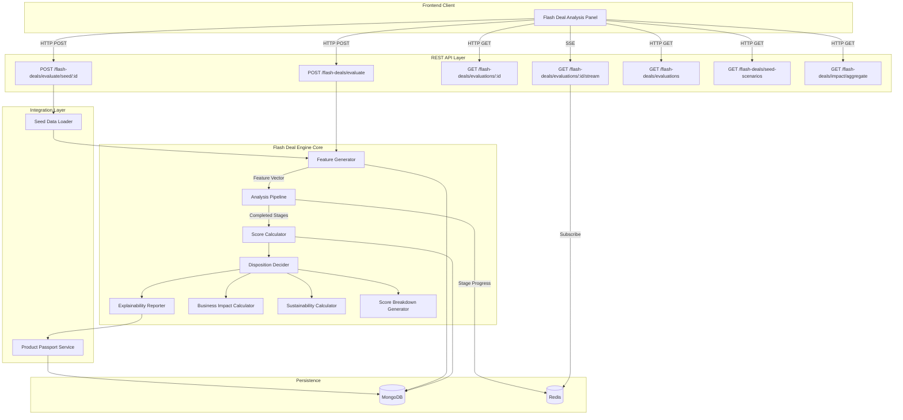
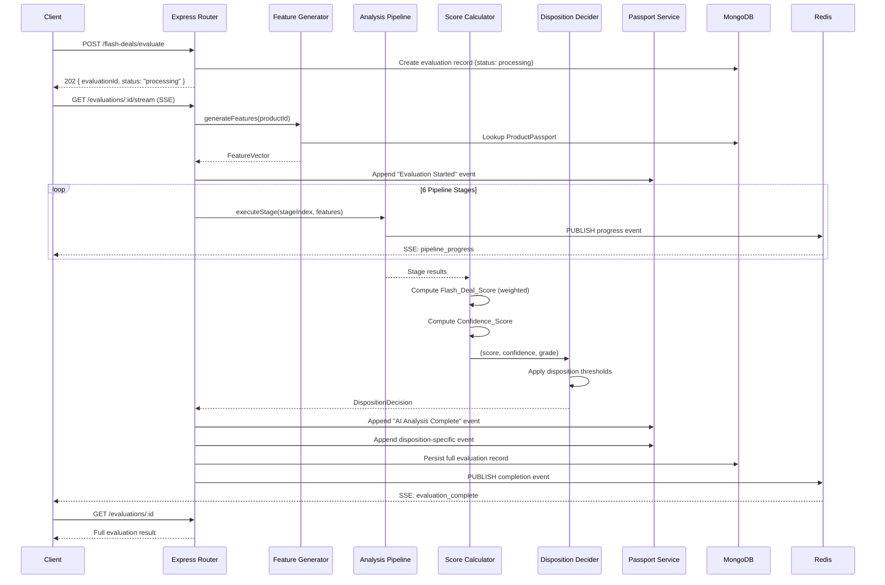

# Design Document: Flash Deal Eligibility Engine

## Overview

The Flash Deal Eligibility Engine is a deterministic scoring service that simulates an AI decision pipeline for evaluating whether open-box returned products should be listed as Hyperlocal Flash Deals. It integrates with the existing ProductPassport lifecycle system and produces a Flash Deal Score, confidence rating, one of five disposition decisions, and explainability artifacts — all without requiring actual ML training.

### Key Design Decisions

1. **Simulated AI, deterministic scoring**: Uses weighted factor computation rather than ML inference. All outputs are reproducible given the same inputs.
2. **SSE for pipeline progress**: Real-time streaming of the 6-stage analysis pipeline over Server-Sent Events to create an animated AI experience.
3. **Score breakdown transparency**: Individual contributor points sum exactly to the total Flash Deal Score — no hidden rounding or remainder.
4. **Integration-first**: Every evaluation creates routing history events in the existing ProductPassport model rather than operating as a standalone tool.
5. **Seed-driven demos**: 5 pre-configured scenarios produce deterministic outputs covering all 5 disposition decisions.

### Technology Stack

| Layer | Technology | Rationale |
|-------|-----------|-----------|
| API Server | Node.js + Express + TypeScript | Matches existing backend stack |
| Database | MongoDB (Mongoose) | Consistent with existing models |
| Cache/Pub-Sub | Redis (ioredis) | SSE state management, evaluation status |
| Real-time | Server-Sent Events | Lightweight, unidirectional pipeline progress |
| Testing | Vitest + fast-check | Property-based testing already in devDependencies |

## Architecture

### System Architecture Diagram



### Evaluation Flow Sequence



## Components and Interfaces

### 1. Feature Generator

**Responsibility:** Produces complete, validated feature vectors from product data, ProductPassport records, or seed configurations.

```typescript
// src/services/flashDeal/featureGenerator.ts

interface ProductFeatures {
  category: string;
  mrp: number;                    // 500–150000
  currentMarketPrice: number;     // 200–140000 (≤ MRP)
  brandPopularityScore: number;   // 0–100
}

interface ConditionFeatures {
  inspectionGrade: 'A' | 'B' | 'C' | 'D' | 'F';
  packagingCondition: 'Original' | 'Damaged' | 'Missing';
  damageScore: number;            // 0–100
  batteryHealth: number;          // 0–100
}

interface DemandFeatures {
  wishlistCount: number;          // 0–500
  cartCount: number;              // 0–200
  nearbyInterestedBuyers: number; // 0–50
  historicalConversionRate: number; // 0.0–1.0
}

interface LocationFeatures {
  city: string;
  demandDensity: number;          // 0–100
  distanceToBuyers: number;       // 0.5–100 km
}

interface FinancialFeatures {
  expectedRecoveryValue: number;  // 100–140000
  warehouseCostAvoided: number;   // 50–500
  deliveryCostSaved: number;      // 20–300
}

interface FeatureVector {
  product: ProductFeatures;
  condition: ConditionFeatures;
  demand: DemandFeatures;
  location: LocationFeatures;
  financial: FinancialFeatures;
  metadata: {
    source: 'passport' | 'seed' | 'random';
    syntheticFields: string[];    // fields generated due to missing data
    generatedAt: string;          // ISO 8601
  };
}

interface FeatureGeneratorService {
  generateFromPassport(passportId: string): Promise<FeatureVector>;
  generateFromSeed(scenarioId: string): FeatureVector;
  generateRandom(): FeatureVector;
  validate(features: FeatureVector): ValidationResult;
  clampToRange(value: number, min: number, max: number, fieldName: string): number;
}
```

### 2. Analysis Pipeline

**Responsibility:** Executes six sequential evaluation stages with configurable timing and emits real-time progress events via Redis pub/sub.

```typescript
// src/services/flashDeal/analysisPipeline.ts

interface PipelineStage {
  name: string;
  index: number;               // 1–6
  status: 'pending' | 'in_progress' | 'completed' | 'failed';
  durationMs: number;          // 500–2000 per stage
  result?: StageResult;
}

interface StageResult {
  categoryScore: number;       // 0–100 normalized score for this dimension
  factors: string[];           // key factors identified in this stage
}

interface PipelineConfig {
  stages: Array<{
    name: string;
    minDurationMs: number;     // default: 500
    maxDurationMs: number;     // default: 2000
  }>;
  totalMinDurationMs: number;  // default: 3000
  totalMaxDurationMs: number;  // default: 8000
  progressIntervalMs: number;  // default: 200
}

interface PipelineProgressEvent {
  evaluationId: string;
  stage: string;
  stageIndex: number;          // 1–6
  progress: number;            // 0–100
  status: 'pending' | 'in_progress' | 'completed';
}

interface AnalysisPipelineService {
  execute(evaluationId: string, features: FeatureVector): Promise<PipelineStage[]>;
  getDefaultConfig(): PipelineConfig;
}

// Default stage definitions
const DEFAULT_STAGES = [
  { name: 'Analyzing Product', minDurationMs: 500, maxDurationMs: 1500 },
  { name: 'Evaluating Demand Signals', minDurationMs: 500, maxDurationMs: 1500 },
  { name: 'Evaluating Product Condition', minDurationMs: 500, maxDurationMs: 1500 },
  { name: 'Evaluating Recovery Value', minDurationMs: 500, maxDurationMs: 1500 },
  { name: 'Evaluating Buyer Density', minDurationMs: 500, maxDurationMs: 1500 },
  { name: 'Evaluating Conversion Probability', minDurationMs: 500, maxDurationMs: 2000 },
];
```

### 3. Score Calculator

**Responsibility:** Computes Flash Deal Score as a weighted sum of normalized category scores, and Confidence Score based on feature completeness and consistency.

```typescript
// src/services/flashDeal/scoreCalculator.ts

interface ScoreWeights {
  condition: number;  // 0.30
  demand: number;     // 0.30
  financial: number;  // 0.25
  location: number;   // 0.15
}

interface CategoryScores {
  condition: number;  // 0–100
  demand: number;     // 0–100
  financial: number;  // 0–100
  location: number;   // 0–100
}

interface ScoreResult {
  flashDealScore: number;       // 0–100 integer
  confidenceScore: number;      // 0–100 integer
  categoryScores: CategoryScores;
  weights: ScoreWeights;
}

interface ScoreCalculatorService {
  computeScore(features: FeatureVector, stageResults: PipelineStage[]): ScoreResult;
  computeConfidence(features: FeatureVector, categoryScores: CategoryScores, flashDealScore: number): number;
  normalizeCategoryScore(features: Partial<Record<string, number>>, category: string): number;
}
```

### 4. Disposition Decider

**Responsibility:** Maps Flash Deal Score + Confidence Score + Inspection Grade to exactly one of five dispositions using priority-ordered threshold rules.

```typescript
// src/services/flashDeal/dispositionDecider.ts

type DispositionDecision = 
  | 'FLASH_DEAL'
  | 'AMAZON_RENEWED'
  | 'NORMAL_RESALE'
  | 'CIRCULAR_ROUTING'
  | 'WAREHOUSE_RETURN';

interface DispositionRule {
  decision: DispositionDecision;
  priority: number;            // 1 = highest
  condition: (score: number, confidence: number, grade: string) => boolean;
}

interface DispositionResult {
  decision: DispositionDecision;
  matchedRule: string;         // human-readable rule description
  flashDealScore: number;
  confidenceScore: number;
  inspectionGrade: string;
}

interface DispositionDeciderService {
  decide(score: number, confidence: number, inspectionGrade: string): DispositionResult;
  getColorMapping(decision: DispositionDecision): string;
  getDisplayLabel(decision: DispositionDecision): string;
}

// Disposition Rules (ordered by priority)
const DISPOSITION_RULES: DispositionRule[] = [
  {
    decision: 'FLASH_DEAL',
    priority: 1,
    condition: (score, confidence) => score >= 75 && confidence >= 60,
  },
  {
    decision: 'AMAZON_RENEWED',
    priority: 2,
    condition: (score, _conf, grade) => score >= 50 && score <= 74 && ['A', 'B'].includes(grade),
  },
  {
    decision: 'NORMAL_RESALE',
    priority: 3,
    condition: (score, _conf, grade) => score >= 30 && score <= 74 && ['C', 'D', 'F'].includes(grade),
  },
  {
    decision: 'CIRCULAR_ROUTING',
    priority: 4,
    condition: (score) => score >= 15 && score <= 29,
  },
  {
    decision: 'WAREHOUSE_RETURN',
    priority: 5,
    condition: (score, confidence) => score < 15 || confidence < 30,
  },
];

const COLOR_MAP: Record<DispositionDecision, string> = {
  FLASH_DEAL: 'green',
  AMAZON_RENEWED: 'blue',
  NORMAL_RESALE: 'amber',
  CIRCULAR_ROUTING: 'purple',
  WAREHOUSE_RETURN: 'red',
};
```

### 5. Explainability Reporter

**Responsibility:** Generates factor lists and natural-language explanations based on feature percentile analysis.

```typescript
// src/services/flashDeal/explainabilityReporter.ts

interface Factor {
  label: string;               // e.g., "✓ High Wishlist Activity" or "✗ Low Margin"
  featureName: string;
  value: number;
  percentile: number;          // position within feature's range (0–100)
}

interface ExplainabilityReport {
  positiveFactors: Factor[];   // 1–5 items, features > 70th percentile
  negativeFactors: Factor[];   // 1–5 items, features < 30th percentile
  explanation: string;         // 2–4 sentence natural-language paragraph
}

interface ExplainabilityReporterService {
  generateReport(
    features: FeatureVector,
    disposition: DispositionDecision,
    flashDealScore: number
  ): ExplainabilityReport;
  computePercentile(value: number, min: number, max: number): number;
  generateExplanation(
    disposition: DispositionDecision,
    topPositive: Factor | null,
    topNegative: Factor | null,
    flashDealScore: number
  ): string;
}
```

### 6. Score Breakdown Generator

**Responsibility:** Decomposes Flash Deal Score into individual contributor points that sum exactly to the total.

```typescript
// src/services/flashDeal/scoreBreakdownGenerator.ts

interface ScoreContributor {
  name: string;
  points: number;              // 0 to maximum
  maximum: number;             // fixed per contributor
}

// Contributor maximums (sum = 100)
const CONTRIBUTOR_MAXIMUMS = {
  'Condition Grade': 30,
  'Local Demand': 15,
  'Wishlist Activity': 15,
  'Margin Potential': 25,
  'Buyer Density': 15,
} as const;

interface ScoreBreakdownService {
  generateBreakdown(
    flashDealScore: number,
    categoryScores: CategoryScores,
    features: FeatureVector
  ): ScoreContributor[];
  
  // Ensures points sum exactly to flashDealScore
  distributePoints(
    rawPoints: Record<string, number>,
    targetTotal: number
  ): ScoreContributor[];
}
```

### 7. Business Impact Calculator

**Responsibility:** Computes cost savings, revenue recovery, and operational metrics for each evaluation.

```typescript
// src/services/flashDeal/businessImpactCalculator.ts

interface CostConfig {
  reversePickup: number;       // default: 120 INR
  hubProcessing: number;       // default: 80 INR
  warehouseInbound: number;    // default: 90 INR
  reListing: number;           // default: 100 INR
  localDelivery: number;       // default: 120 INR
  inspection: number;          // default: 50 INR
}

interface BusinessImpact {
  traditionalReturnCost: number;   // INR, 2 decimal places
  flashDealRouteCost: number;      // INR, 2 decimal places
  savingsAmount: number;           // traditional - flashDeal
  costReductionPercentage: number; // 1 decimal place
  warehouseTouchesAvoided: number; // integer count
  estimatedRecoveryValue: number | null;  // null if missing inputs
  revenueRecoveryRate: number | null;     // null if missing inputs
  missingInputs?: string[];        // which inputs were unavailable
}

const GRADE_DEPRECIATION: Record<string, number> = {
  A: 1.0,
  B: 0.85,
  C: 0.70,
  D: 0.50,
  F: 0.50,
};

interface BusinessImpactService {
  calculate(features: FeatureVector, config?: Partial<CostConfig>): BusinessImpact;
  calculateAggregate(): Promise<AggregateImpact>;
}
```

### 8. Sustainability Calculator

**Responsibility:** Computes environmental impact metrics including distance saved and CO2 reduction.

```typescript
// src/services/flashDeal/sustainabilityCalculator.ts

interface SustainabilityConfig {
  warehouseReturnDistance: number;  // default: 100 km round-trip
  emissionFactor: number;          // default: 0.027 kg CO2/km
}

interface SustainabilityMetrics {
  traditionalDistance: number;      // km, 2 decimal places
  flashDealDistance: number;        // km, 2 decimal places
  distanceSaved: number;           // km, 2 decimal places
  co2Saved: number;                // kg, 2 decimal places
}

interface SustainabilityService {
  calculate(
    distanceToBuyers: number,
    disposition: DispositionDecision,
    config?: Partial<SustainabilityConfig>
  ): SustainabilityMetrics;
  calculateAggregate(): Promise<AggregateSustainability>;
}
```

### 9. Product Passport Integration Service

**Responsibility:** Manages routing history event creation in the ProductPassport model during evaluations.

```typescript
// src/services/flashDeal/passportIntegration.ts

interface PassportIntegrationService {
  appendEvaluationStarted(passportId: string, evaluationId: string): Promise<void>;
  appendAnalysisComplete(passportId: string, score: number, decision: DispositionDecision): Promise<void>;
  appendDispositionEvent(passportId: string, decision: DispositionDecision, details: string): Promise<void>;
  appendBuyerReserved(passportId: string, buyerCity: string, distance: number): Promise<void>;
  createPassportIfNotExists(features: FeatureVector, evaluationEvents: RoutingEvent[]): Promise<string>;
}
```

### API Contracts

```
POST   /api/v1/flash-deals/evaluate                — Trigger evaluation (product ID or feature vector)
POST   /api/v1/flash-deals/evaluate/seed/:scenarioId — Trigger evaluation with seed scenario
GET    /api/v1/flash-deals/evaluations/:id          — Get evaluation status/result
GET    /api/v1/flash-deals/evaluations/:id/stream   — SSE pipeline progress
GET    /api/v1/flash-deals/evaluations              — Paginated evaluation history
GET    /api/v1/flash-deals/seed-scenarios           — List seed scenarios
GET    /api/v1/flash-deals/impact/aggregate         — Aggregate business + sustainability totals
```

## Data Models

### FlashDealEvaluation Document

```typescript
// src/models/FlashDealEvaluation.ts

interface IFlashDealEvaluation {
  evaluationId: string;            // UUID
  productId: string | null;        // passport ID if from passport
  scenarioId: string | null;       // seed scenario ID if from seed
  status: 'processing' | 'completed' | 'failed';
  
  inputFeatures: FeatureVector;
  
  pipelineStages: Array<{
    name: string;
    index: number;
    status: 'pending' | 'in_progress' | 'completed' | 'failed';
    durationMs: number;
    startedAt: string;
    completedAt: string;
  }>;
  
  result: {
    flashDealScore: number;
    confidenceScore: number;
    dispositionDecision: DispositionDecision;
    categoryScores: CategoryScores;
    matchedRule: string;
  } | null;
  
  explainability: ExplainabilityReport | null;
  scoreBreakdown: ScoreContributor[] | null;
  businessImpact: BusinessImpact | null;
  sustainability: SustainabilityMetrics | null;
  
  startedAt: string;               // ISO 8601
  completedAt: string | null;      // ISO 8601
  error: string | null;
  
  createdAt: Date;
  updatedAt: Date;
}
```

### FlashDealSeedScenario Document

```typescript
// src/models/FlashDealSeedScenario.ts

interface IFlashDealSeedScenario {
  scenarioId: string;              // e.g., "flash-deal-01"
  name: string;                    // ≤ 100 chars
  description: string;             // ≤ 500 chars
  category: string;                // Electronics, Fashion, Home Appliances
  city: string;
  features: FeatureVector;         // pre-configured deterministic features
  expectedDecision: DispositionDecision;
  createdAt: Date;
  updatedAt: Date;
}
```

### MongoDB Indexes

```javascript
// Flash Deal Evaluations
db.flash_deal_evaluations.createIndex({ evaluationId: 1 }, { unique: true });
db.flash_deal_evaluations.createIndex({ status: 1, createdAt: -1 });
db.flash_deal_evaluations.createIndex({ "result.dispositionDecision": 1, createdAt: -1 });
db.flash_deal_evaluations.createIndex({ "inputFeatures.product.category": 1, createdAt: -1 });
db.flash_deal_evaluations.createIndex({ productId: 1 });

// Seed Scenarios
db.flash_deal_seed_scenarios.createIndex({ scenarioId: 1 }, { unique: true });
```

### Seed Scenarios Data

Five scenarios covering all dispositions:

| # | Name | Category | City | Grade | Score | Decision |
|---|------|----------|------|-------|-------|----------|
| 1 | Premium Smartphone - Excellent Condition | Electronics | Mumbai | A | 88 | FLASH_DEAL |
| 2 | Designer Jacket - Minor Wear | Fashion | Delhi | B | 62 | AMAZON_RENEWED |
| 3 | Bluetooth Speaker - Fair Condition | Electronics | Bangalore | C | 45 | NORMAL_RESALE |
| 4 | Kitchen Mixer - Damaged Packaging | Home Appliances | Hyderabad | D | 22 | CIRCULAR_ROUTING |
| 5 | Budget Earbuds - Poor Condition | Electronics | Chennai | F | 8 | WAREHOUSE_RETURN |

## Correctness Properties

*A property is a characteristic or behavior that should hold true across all valid executions of a system — essentially, a formal statement about what the system should do. Properties serve as the bridge between human-readable specifications and machine-verifiable correctness guarantees.*

### Property 1: Feature Vector Completeness and Bounds

*For any* generated feature vector (whether from passport, seed, or random source), all numeric fields SHALL fall within their defined bounds (MRP: 500–150000, Current Market Price: 200–140000, Brand Popularity: 0–100, Damage Score: 0–100, Battery Health: 0–100, Wishlist Count: 0–500, Cart Count: 0–200, Nearby Buyers: 0–50, Conversion Rate: 0.0–1.0, Demand Density: 0–100, Distance: 0.5–100, Recovery Value: 100–140000, Warehouse Cost: 50–500, Delivery Cost: 20–300), and Current Market Price SHALL NOT exceed MRP.

**Validates: Requirements 1.1, 1.3, 1.4**

### Property 2: Feature Validation Clamping

*For any* numeric feature value that falls outside its defined range, the validation function SHALL clamp it to the nearest bound (minimum if below, maximum if above), and the resulting value SHALL always be within the defined range.

**Validates: Requirements 1.4, 1.6**

### Property 3: Malformed Feature Vector Rejection

*For any* feature vector missing one or more required fields (any field from product, condition, demand, location, or financial categories), the Analysis Pipeline SHALL reject the input without initiating evaluation stages and SHALL identify all missing/invalid fields in the error response.

**Validates: Requirements 2.6**

### Property 4: Flash Deal Score Weighted Computation

*For any* valid feature vector with normalized category scores (each 0–100), the Flash Deal Score SHALL equal the integer result of: (condition_score × 0.30) + (demand_score × 0.30) + (financial_score × 0.25) + (location_score × 0.15), rounded to the nearest integer, and SHALL be in the range [0, 100].

**Validates: Requirements 3.1**

### Property 5: Confidence Score Computation

*For any* valid feature vector with computed category scores, the Confidence Score SHALL be an integer in [0, 100] that increases with the percentage of non-null feature values (completeness) and decreases when individual category scores deviate more than 25 points from the weighted Flash Deal Score (consistency).

**Validates: Requirements 3.2**

### Property 6: Disposition Assignment Uniqueness and Priority

*For any* combination of Flash Deal Score (0–100), Confidence Score (0–100), and Inspection Grade (A/B/C/D/F), the Disposition Decider SHALL assign exactly one disposition following these priority-ordered rules: FLASH_DEAL (score ≥ 75 AND confidence ≥ 60), AMAZON_RENEWED (50 ≤ score ≤ 74 AND grade in {A, B}), NORMAL_RESALE (30 ≤ score ≤ 74 AND grade in {C, D, F}), CIRCULAR_ROUTING (15 ≤ score ≤ 29), WAREHOUSE_RETURN (score < 15 OR confidence < 30). When multiple rules match, the highest-priority rule wins.

**Validates: Requirements 3.3, 3.4, 3.5**

### Property 7: Explainability Factor Selection

*For any* evaluation with a valid feature vector, the Explainability Report SHALL contain 1–5 positive factors (features scoring above the 70th percentile of their range, prefixed with "✓") and 1–5 negative factors (features scoring below the 30th percentile of their range, prefixed with "✗"). If fewer than 1 factor qualifies in either list, the single highest or lowest scoring feature SHALL be selected to guarantee at least one factor per list.

**Validates: Requirements 4.1, 4.2, 4.3, 4.6**

### Property 8: Explanation Text Completeness

*For any* evaluation producing a Disposition Decision, the natural-language explanation SHALL be 2–4 sentences long and SHALL reference the Disposition Decision name, the top contributing positive factor, the primary risk factor, and the Flash Deal Score value.

**Validates: Requirements 4.4**

### Property 9: Business Impact Arithmetic

*For any* evaluation with configurable cost values (reverse pickup, hub processing, warehouse inbound, re-listing, local delivery, inspection), Traditional Return Cost SHALL equal the sum of reverse pickup + hub processing + warehouse inbound + re-listing, Flash Deal Route Cost SHALL equal local delivery + inspection, Savings Amount SHALL equal Traditional Return Cost minus Flash Deal Route Cost, and Cost Reduction Percentage SHALL equal (Savings / Traditional) × 100.

**Validates: Requirements 9.1, 9.3, 9.4**

### Property 10: Recovery Value Calculation

*For any* evaluation with a valid Current Market Price and Inspection Grade, the Estimated Recovery Value SHALL equal Current Market Price × depreciation factor (A=1.0, B=0.85, C=0.70, D=0.50, F=0.50), and the result SHALL be rounded to 2 decimal places.

**Validates: Requirements 9.2**

### Property 11: Sustainability Distance and CO2 Calculation

*For any* evaluation with a non-WAREHOUSE_RETURN disposition, Traditional Distance SHALL equal Distance_To_Buyers + warehouse return distance (default 100 km), Flash Deal Distance SHALL equal Distance_To_Buyers, Distance Saved SHALL equal Traditional Distance minus Flash Deal Distance, and CO2 Saved SHALL equal Distance Saved × emission factor (default 0.027 kg/km). For WAREHOUSE_RETURN dispositions, all sustainability metrics SHALL be zero.

**Validates: Requirements 10.1, 10.2, 10.3, 10.5**

### Property 12: Score Breakdown Sum Invariant

*For any* evaluation producing a Flash Deal Score, the score breakdown SHALL contain exactly 5 contributors (Condition Grade max 30, Local Demand max 15, Wishlist Activity max 15, Margin Potential max 25, Buyer Density max 15), each contributor's points SHALL be between 0 and its maximum (inclusive), and the sum of all contributor points SHALL equal the Flash Deal Score exactly with no rounding loss.

**Validates: Requirements 11.1, 11.2, 11.4**

### Property 13: Score Breakdown Ordering

*For any* score breakdown, contributors SHALL be ordered from highest points-contributed to lowest. When two or more contributors have equal points, they SHALL be ordered alphabetically by name.

**Validates: Requirements 11.3**

### Property 14: Disposition Display Label Mapping

*For any* evaluation with a non-FLASH_DEAL disposition, the routing history event appended to the Product Passport SHALL use the event name "Routed to {label}" where label maps: AMAZON_RENEWED → "Amazon Renewed", NORMAL_RESALE → "Normal Resale", CIRCULAR_ROUTING → "Circular Routing", WAREHOUSE_RETURN → "Warehouse Return".

**Validates: Requirements 12.5**

## Error Handling

### Feature Generation Errors

| Error Condition | Handling Strategy |
|----------------|-------------------|
| ProductPassport not found | Generate random features, flag as synthetic |
| Passport missing inspection data | Generate missing values within bounds, flag as synthetic |
| Feature value out of range | Clamp to nearest bound, log correction |
| Feature generation timeout (>2s) | Return error, do not start pipeline |

### Pipeline Errors

| Error Condition | Handling Strategy |
|----------------|-------------------|
| Stage failure | Mark evaluation as "failed", record failed stage, return partial results |
| Client disconnects during SSE | Continue processing, store result for polling (5 min retention) |
| Redis unavailable for SSE | Pipeline continues, progress events lost, final result still persisted |

### Persistence Errors

| Error Condition | Handling Strategy |
|----------------|-------------------|
| Evaluation save fails | Retry once, if retry fails log error, return result to client anyway |
| Passport update fails | Log failure, complete evaluation normally |
| Aggregate query timeout | Return cached aggregate or error within 2s |

### API Errors

| HTTP Status | Condition |
|-------------|-----------|
| 400 | Missing product ID and feature vector in evaluate request |
| 404 | Unknown product ID, scenario ID, or evaluation ID |
| 500 | Unexpected server error during evaluation |

## Testing Strategy

### Property-Based Tests (fast-check, minimum 100 iterations each)

Property-based testing is appropriate for this feature because the core engine is composed of pure functions (scoring, disposition logic, cost calculations, factor selection) that have universal properties holding across a wide input space.

**Library:** `fast-check` (already in devDependencies)

**Configuration:** Each property test runs a minimum of 100 iterations with randomized inputs.

**Tag format:** `Feature: flash-deal-eligibility-engine, Property {N}: {description}`

Tests to implement:
1. Feature vector bounds validation (Property 1)
2. Clamping correctness (Property 2)
3. Malformed input rejection (Property 3)
4. Score computation accuracy (Property 4)
5. Confidence score range and behavior (Property 5)
6. Disposition uniqueness and priority (Property 6)
7. Factor selection from percentiles (Property 7)
8. Explanation text structure (Property 8)
9. Business impact arithmetic (Property 9)
10. Recovery value formula (Property 10)
11. Sustainability calculations (Property 11)
12. Score breakdown sum invariant (Property 12)
13. Score breakdown ordering (Property 13)
14. Disposition label mapping (Property 14)

### Unit Tests (vitest, example-based)

- Seed scenario determinism: run each seed 3 times, assert identical outputs
- Seed scenario coverage: verify all 5 dispositions are covered
- Seed data structure: names ≤ 100 chars, descriptions ≤ 500 chars, 3+ categories, 3+ cities
- Color mapping: each disposition maps to correct color
- Response payload structure validation
- Pipeline stage count and ordering

### Integration Tests (vitest + supertest)

- POST /evaluate with product ID → returns evaluation ID
- POST /evaluate/seed/:id → returns evaluation ID
- GET /evaluations/:id → returns completed result
- SSE stream delivers progress events
- GET /evaluations → paginated history with filters
- GET /impact/aggregate → cumulative totals
- ProductPassport routing history event creation
- DEMO_MODE auto-seeding on startup
- 404/400 error responses for invalid inputs

### Edge Case Tests

- Passport exists but missing inspection data → synthetic field generation
- Client disconnects during pipeline → result still persisted
- Persistence failure → retry + graceful degradation
- All features at boundary values (min/max extremes)
- Score exactly at disposition threshold boundaries (e.g., score=75, confidence=60)
