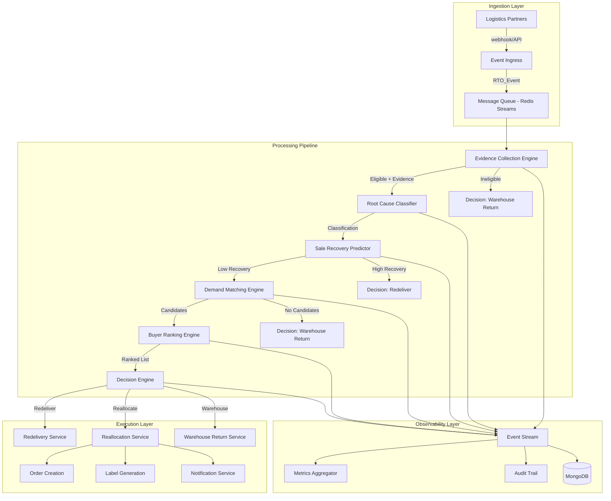
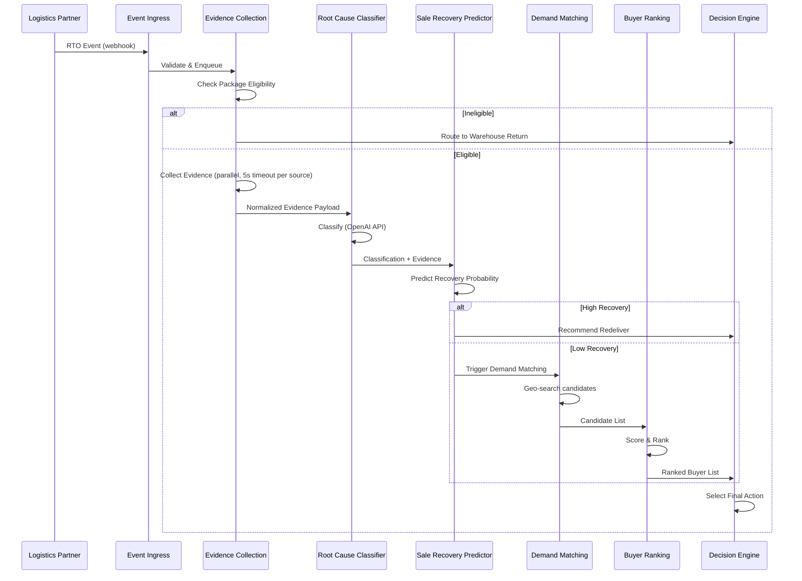
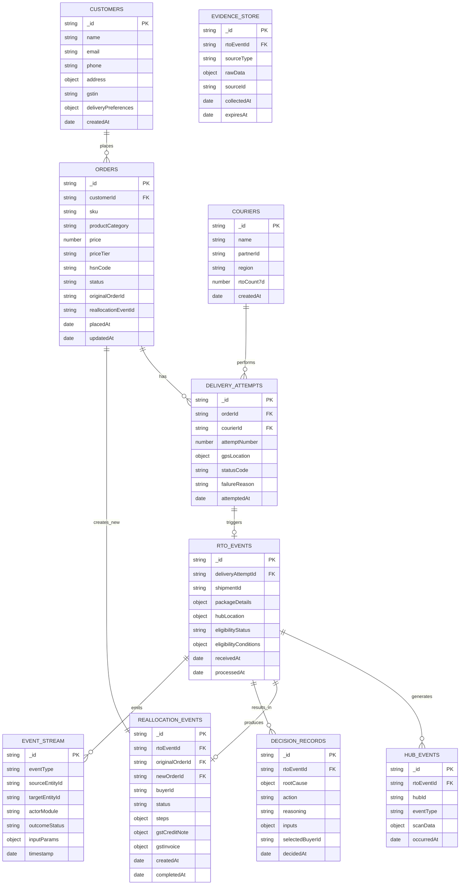

# Design Document: RTO Reallocation Engine

## Overview

The RTO Reallocation Engine is an event-driven system that intercepts Return-To-Origin shipments in transit and determines the optimal next action: redeliver to the original customer, reallocate to a nearby buyer, or return to warehouse. The system operates as a pipeline of specialized modules orchestrated by a central Decision Engine.

### High-Level Architecture

The system follows a modular, event-driven architecture with clear separation between:
- **Ingestion Layer** — receives RTO events from logistics partners
- **Processing Pipeline** — evidence collection → classification → prediction → matching → ranking → decision
- **Execution Layer** — carries out the selected action (redeliver, reallocate, or warehouse return)
- **Observability Layer** — metrics, audit trails, event streaming

### Technology Stack (Hackathon MVP)

| Layer | Technology | Rationale |
|-------|-----------|-----------|
| Frontend | React + Vite | Fast development, dashboard visualization |
| API Server | Node.js + Express | Event handling, REST APIs, WebSocket for real-time |
| ML Services | Python + FastAPI | OpenAI API integration, scikit-learn models |
| Database | MongoDB | Flexible schema for evidence documents, time-series events |
| Message Queue | Redis Streams (MVP) / Kafka (scale) | Event buffering, pub/sub for pipeline stages |
| Cache | Redis | Hot data: buyer candidates, recent classifications |
| ML/AI | OpenAI GPT-4 (classification), scikit-learn (prediction) | MVP rapid development; replaceable with fine-tuned models |

### Scale Path

For Amazon-scale (1000+ events/second):
- Replace Redis Streams with Apache Kafka (partitioned by region)
- Add Kubernetes horizontal pod autoscaling per module
- Move ML inference to dedicated GPU instances with model serving (TensorFlow Serving / Triton)
- Shard MongoDB by region/date, add read replicas
- Introduce circuit breakers (Hystrix pattern) between modules

## Architecture

### System Architecture Diagram



### Event Flow Sequence



## Components and Interfaces

### 1. Event Ingress Service

**Responsibility:** Receives RTO events from logistics partners, validates schema, deduplicates, and publishes to the message queue.

```typescript
// src/services/eventIngress.ts
interface RTOEventPayload {
  shipmentId: string;
  orderId: string;
  customerId: string;
  courierId: string;
  packageDetails: {
    sku: string;
    weight: number;
    dimensions: { l: number; w: number; h: number };
    category: string;
    price: number;
    hsnCode: string;
  };
  deliveryAttempt: {
    attemptNumber: number;
    timestamp: string; // ISO 8601
    gpsLocation: { lat: number; lng: number };
    statusCode: string;
    failureReason: string;
  };
  hubLocation: { lat: number; lng: number; hubId: string };
  metadata: { source: string; receivedAt: string };
}

interface EventIngressService {
  receiveEvent(payload: RTOEventPayload): Promise<{ eventId: string; accepted: boolean }>;
  validateSchema(payload: unknown): ValidationResult;
  deduplicateCheck(shipmentId: string): Promise<boolean>;
}
```

### 2. Evidence Collection Engine

**Responsibility:** Gathers delivery evidence from multiple sources, verifies package eligibility, normalizes data.

```typescript
// src/services/evidenceCollection.ts
interface EvidenceSource {
  type: 'gps' | 'call_logs' | 'delivery_scans' | 'order_history' | 'support_tickets' | 'address_validation' | 'hub_events';
  data: unknown;
  collectedAt: string;
  sourceId: string;
}

interface EligibilityResult {
  eligible: boolean;
  conditions: {
    unopened: { pass: boolean; evidenceIds: string[] };
    undamaged: { pass: boolean; evidenceIds: string[] };
    sealed: { pass: boolean; evidenceIds: string[] };
  };
  determinedAt: string;
}

interface NormalizedEvidence {
  rtoEventId: string;
  eligibility: EligibilityResult;
  sources: EvidenceSource[];
  completeness: {
    collected: string[];    // source types that responded
    unavailable: string[];  // source types that timed out
    timeoutTimestamps: Record<string, string>;
  };
  normalizedAt: string;
}

interface EvidenceCollectionEngine {
  verifyEligibility(event: RTOEventPayload): Promise<EligibilityResult>;
  collectEvidence(event: RTOEventPayload, lookbackHours: number): Promise<EvidenceSource[]>;
  normalizeEvidence(sources: EvidenceSource[], rtoEventId: string): NormalizedEvidence;
}
```

### 3. Root Cause Classifier

**Responsibility:** AI-powered classification of delivery failure root cause.

```python
# src/ml/root_cause_classifier.py
from dataclasses import dataclass
from enum import Enum
from typing import Optional

class RootCauseCategory(Enum):
    CUSTOMER_ISSUE = "customer_issue"
    COURIER_ISSUE = "courier_issue"
    SYSTEM_ISSUE = "system_issue"

class CustomerSubCause(Enum):
    UNAVAILABLE = "customer_unavailable"
    WRONG_ADDRESS = "wrong_address"
    REFUSED_DELIVERY = "refused_delivery"
    CANCELLATION = "cancellation"
    NOT_INTERESTED = "not_interested"

class CourierSubCause(Enum):
    FAKE_ATTEMPT = "fake_delivery_attempt"
    NO_CONTACT = "courier_never_contacted"
    GPS_ANOMALY = "gps_anomaly"
    ROUTE_DEVIATION = "route_deviation"
    INCORRECT_STATUS = "incorrect_status_update"
    FAILED_DESPITE_AVAILABLE = "failed_despite_availability"

class SystemSubCause(Enum):
    ADDRESS_MAPPING = "address_mapping_error"
    ROUTING_ENGINE = "routing_engine_issue"
    ORDER_SYNC = "order_synchronization_failure"
    WRONG_LOGISTICS = "wrong_logistics_assignment"
    PLATFORM_BUG = "platform_bug"

@dataclass
class ClassificationResult:
    customer_score: float  # 0.0 to 1.0
    courier_score: float   # 0.0 to 1.0
    system_score: float    # 0.0 to 1.0
    primary_category: Optional[RootCauseCategory]
    sub_cause: Optional[str]
    sub_cause_confidence: float
    confidence_threshold: float
    requires_manual_review: bool
    classification_timestamp: str

class RootCauseClassifier:
    def __init__(self, confidence_threshold: float = 0.6, sub_cause_threshold: float = 0.5):
        ...

    async def classify(self, evidence: dict) -> ClassificationResult:
        """
        Analyzes normalized evidence using OpenAI API to produce
        root cause scores and sub-cause identification.
        """
        ...

    def _build_classification_prompt(self, evidence: dict) -> str:
        """Constructs the LLM prompt with structured evidence."""
        ...

    def _determine_primary_category(self, scores: dict) -> Optional[RootCauseCategory]:
        """Selects primary category based on threshold and priority rules."""
        ...
```

### 4. Sale Recovery Predictor

**Responsibility:** ML model predicting redelivery success probability.

```python
# src/ml/sale_recovery_predictor.py
from dataclasses import dataclass
from typing import Optional

@dataclass
class PredictionFeatures:
    prior_orders: int
    return_rate: float
    avg_order_value: float
    hours_since_order: float
    product_category: str
    price_tier: str  # 'low', 'medium', 'high', 'premium'
    responded_to_notifications: bool
    initiated_support: bool
    updated_preferences: bool
    imputed_features: list[str]  # names of features that used population median

@dataclass
class RecoveryPrediction:
    recovery_probability: float  # 0.0 to 1.0
    features_used: PredictionFeatures
    partially_imputed: bool
    model_version: str
    predicted_at: str

class SaleRecoveryPredictor:
    POPULATION_MEDIANS = {
        "prior_orders": 3,
        "return_rate": 0.12,
        "avg_order_value": 850.0,
        "hours_since_order": 48.0,
    }

    def __init__(self, model_path: str):
        ...

    async def predict(self, classification: dict, customer_data: dict, order_data: dict) -> RecoveryPrediction:
        """Compute recovery probability using trained model."""
        ...

    def _extract_features(self, customer_data: dict, order_data: dict) -> PredictionFeatures:
        """Extract and impute features from raw data."""
        ...
```

### 5. Demand Matching Engine

**Responsibility:** Identifies nearby buyers with demand for the RTO package's product.

```typescript
// src/services/demandMatching.ts
interface DemandCandidate {
  buyerId: string;
  matchType: 'existing_order' | 'cart' | 'wishlist' | 'predicted_intent';
  matchConfidence: number;
  location: { lat: number; lng: number };
  distanceKm: number;
  orderId?: string;         // for existing_order type
  intentScore?: number;     // for predicted_intent type
  lastRefusalCheck: { refused: boolean; category?: string; checkDate: string };
}

interface DemandMatchConfig {
  radiusKm: number;           // default: 50
  intentThreshold: number;    // default: 0.6
  refusalLookbackDays: number; // default: 90
  cartRecencyDays: number;    // default: 7
}

interface DemandMatchingEngine {
  findCandidates(
    sku: string,
    packageLocation: { lat: number; lng: number },
    productCategory: string,
    config?: Partial<DemandMatchConfig>
  ): Promise<DemandCandidate[]>;

  filterRefusals(candidates: DemandCandidate[], productCategory: string): DemandCandidate[];
}
```

### 6. Buyer Ranking Engine

**Responsibility:** Scores and ranks candidate buyers by composite fitness.

```typescript
// src/services/buyerRanking.ts
interface RankingWeights {
  distance: number;           // default: 0.25
  conversionProbability: number; // default: 0.35
  deliverySpeed: number;      // default: 0.20
  marginImpact: number;       // default: 0.20
}

interface ScoredCandidate {
  buyerId: string;
  compositeScore: number;     // 0.0 to 1.0
  factors: {
    distance: { value: number; imputed: boolean };
    conversionProbability: { value: number; imputed: boolean };
    deliverySpeed: { value: number; imputed: boolean };
    marginImpact: { value: number; imputed: boolean };
  };
  partiallyScored: boolean;
}

interface BuyerRankingEngine {
  rankCandidates(
    candidates: DemandCandidate[],
    packageDetails: { price: number; category: string },
    weights?: RankingWeights,
    minThreshold?: number
  ): ScoredCandidate[];
}
```

### 7. Decision Engine

**Responsibility:** Orchestrates the full pipeline and selects the final action.

```typescript
// src/services/decisionEngine.ts
type DecisionAction = 'redeliver' | 'reallocate' | 'warehouse_return';

interface DecisionRecord {
  rtoEventId: string;
  rootCause: {
    category: string;
    subCause: string;
    scores: { customer: number; courier: number; system: number };
  };
  action: DecisionAction;
  reasoning: string;          // human-readable summary
  inputs: {
    recoveryProbability: number;
    candidateBuyerCount: number;
    topBuyerScore: number | null;
  };
  selectedBuyerId: string | null;
  timestamp: string;
}

interface DecisionEngine {
  processRTOEvent(event: RTOEventPayload): Promise<DecisionRecord>;
  executeRedelivery(rtoEventId: string, excludeCourierId?: string): Promise<void>;
  executeReallocation(rtoEventId: string, buyerId: string): Promise<void>;
  executeWarehouseReturn(rtoEventId: string, reason: string): Promise<void>;
}
```

### 8. Reallocation Service

**Responsibility:** Handles end-to-end reallocation execution including order creation, label generation, notifications, and rollback.

```typescript
// src/services/reallocationService.ts
interface ReallocationStep {
  step: 'order_creation' | 'label_generation' | 'buyer_notification' | 'original_customer_notification';
  status: 'pending' | 'completed' | 'failed' | 'rolled_back';
  completedAt?: string;
  error?: string;
}

interface ReallocationExecution {
  reallocationEventId: string;
  rtoEventId: string;
  originalOrderId: string;
  newOrderId: string;
  buyerId: string;
  steps: ReallocationStep[];
  gstCreditNote: { noteId: string; generatedAt: string } | null;
  gstInvoice: { invoiceId: string; generatedAt: string } | null;
  status: 'in_progress' | 'completed' | 'failed' | 'rolled_back';
}

interface ReallocationService {
  execute(rtoEventId: string, buyerId: string, packageDetails: any): Promise<ReallocationExecution>;
  rollback(execution: ReallocationExecution): Promise<void>;
  attemptNextBuyer(rtoEventId: string, rankedBuyers: ScoredCandidate[], failedBuyerIndex: number): Promise<ReallocationExecution | null>;
}
```

### 9. Courier Escalation Service

**Responsibility:** Monitors courier behavior patterns and generates escalation alerts.

```typescript
// src/services/courierEscalation.ts
interface EscalationAlert {
  alertId: string;
  courierId: string;
  rtoEventId: string;
  subCause: string;
  evidence: {
    gpsTraces: any[];
    callLogs: any[];
    deliveryScanTimestamps: string[];
    addressValidation: any;
    hubEvents: any[];
    missingEvidenceSources: string[];
  };
  generatedAt: string;
}

interface CourierEscalationService {
  checkForEscalation(courierId: string, classification: ClassificationResult): Promise<EscalationAlert | null>;
  checkPerformanceThreshold(courierId: string, windowDays: number, threshold: number): Promise<boolean>;
  generateAlert(courierId: string, rtoEventId: string, evidence: NormalizedEvidence): EscalationAlert;
}
```

### 10. Metrics & Observability Service

**Responsibility:** Aggregates business metrics, exposes API, detects anomalies.

```typescript
// src/services/metricsService.ts
interface SystemMetrics {
  rtoReductionRate: number;        // percentage
  reverseLogisticsSavings: number; // INR per package
  deliverySuccessRate: number;     // percentage
  inventoryRecoveryRate: number;   // percentage
  co2Reduction: number;            // kg per package
  customerSatisfaction: number;    // 1-5 scale
}

interface AnomalyAlert {
  metricName: string;
  currentValue: number;
  expectedRange: { low: number; high: number };
  deviationMagnitude: number;      // in standard deviations
  detectedAt: string;
}

interface MetricsService {
  getCurrentMetrics(window?: 'daily' | 'weekly' | 'monthly'): Promise<SystemMetrics>;
  getHistoricalComparison(period: 'daily' | 'weekly' | 'monthly'): Promise<{ current: SystemMetrics; previous: SystemMetrics; change: Record<string, number> }>;
  checkAnomalies(): Promise<AnomalyAlert[]>;
}
```

### API Contracts

#### REST API Routes (Express)

```
POST   /api/v1/rto-events              — Receive RTO event from logistics partner
GET    /api/v1/rto-events/:id           — Get RTO event details
GET    /api/v1/rto-events/:id/decision  — Get decision record for an RTO event
GET    /api/v1/rto-events/:id/timeline  — Get full event timeline

GET    /api/v1/orders/:id/history       — Get order decision history
GET    /api/v1/packages/:id/history     — Get package decision history

GET    /api/v1/metrics                  — Get current system metrics
GET    /api/v1/metrics/compare          — Get period-over-period comparison
GET    /api/v1/metrics/anomalies        — Get active anomaly alerts

GET    /api/v1/couriers/:id/escalations — Get courier escalation history
POST   /api/v1/couriers/:id/review      — Trigger manual courier review

GET    /api/v1/config                   — Get system configuration
PATCH  /api/v1/config                   — Update configurable thresholds

GET    /api/v1/health                   — System health check
```

#### Python ML API Routes (FastAPI)

```
POST   /ml/v1/classify                  — Root cause classification
POST   /ml/v1/predict-recovery          — Sale recovery prediction
POST   /ml/v1/demand-intent             — Predicted purchase intent scoring
GET    /ml/v1/models/status             — Model health and version info
```

## Data Models

### MongoDB Collections



### Key Document Schemas

```javascript
// Customer Document
{
  _id: ObjectId,
  name: String,
  email: String,
  phone: String,
  address: {
    line1: String,
    line2: String,
    city: String,
    state: String,
    pincode: String,
    geoLocation: { type: "Point", coordinates: [lng, lat] }
  },
  gstin: String,  // GST Identification Number
  deliveryPreferences: {
    preferredTimeSlot: String,
    alternatePhone: String,
    landmarkNotes: String
  },
  stats: {
    totalOrders: Number,
    returnRate: Number,
    avgOrderValue: Number,
    rtoCount30d: Number
  },
  fraudFlag: { flagged: Boolean, flaggedAt: Date, reason: String },
  createdAt: Date,
  updatedAt: Date
}

// RTO Event Document
{
  _id: ObjectId,
  deliveryAttemptId: ObjectId,
  shipmentId: String,
  orderId: ObjectId,
  customerId: ObjectId,
  courierId: ObjectId,
  packageDetails: {
    sku: String,
    weight: Number,
    dimensions: { l: Number, w: Number, h: Number },
    category: String,
    price: Number,
    hsnCode: String
  },
  hubLocation: {
    type: "Point",
    coordinates: [lng, lat],
    hubId: String
  },
  eligibility: {
    eligible: Boolean,
    conditions: {
      unopened: { pass: Boolean, evidenceIds: [String] },
      undamaged: { pass: Boolean, evidenceIds: [String] },
      sealed: { pass: Boolean, evidenceIds: [String] }
    },
    determinedAt: Date
  },
  classification: {
    customerScore: Number,
    courierScore: Number,
    systemScore: Number,
    primaryCategory: String,
    subCause: String,
    subCauseConfidence: Number,
    requiresManualReview: Boolean,
    classifiedAt: Date
  },
  recoveryPrediction: {
    probability: Number,
    partiallyImputed: Boolean,
    imputedFeatures: [String],
    predictedAt: Date
  },
  decision: {
    action: String,  // 'redeliver' | 'reallocate' | 'warehouse_return'
    reasoning: String,
    inputs: {
      recoveryProbability: Number,
      candidateBuyerCount: Number,
      topBuyerScore: Number
    },
    selectedBuyerId: ObjectId,
    decidedAt: Date
  },
  receivedAt: Date,
  processedAt: Date,
  status: String  // 'received' | 'eligible' | 'ineligible' | 'classified' | 'decided' | 'executed'
}

// Event Stream Document
{
  _id: ObjectId,
  eventType: String,        // 'eligibility_check' | 'classification' | 'prediction' | 'demand_match' | 'ranking' | 'decision' | 'reallocation'
  sourceEntityId: String,
  targetEntityId: String,
  actorModule: String,      // 'evidence_collection' | 'root_cause_classifier' | 'sale_recovery_predictor' | 'demand_matching' | 'buyer_ranking' | 'decision_engine'
  outcomeStatus: String,    // 'success' | 'failure' | 'partial'
  inputParams: Object,      // module-specific inputs that produced the outcome
  timestamp: Date,
  buffered: Boolean,        // true if was locally buffered before emission
  retryCount: Number
}
```

### MongoDB Indexes

```javascript
// Geospatial index for demand matching
db.customers.createIndex({ "address.geoLocation": "2dsphere" });

// Time-based queries for evidence collection
db.hub_events.createIndex({ rtoEventId: 1, occurredAt: -1 });
db.evidence_store.createIndex({ rtoEventId: 1, sourceType: 1 });
db.evidence_store.createIndex({ expiresAt: 1 }, { expireAfterSeconds: 0 });

// Courier escalation queries
db.rto_events.createIndex({ courierId: 1, receivedAt: -1 });
db.rto_events.createIndex({ "classification.primaryCategory": 1, courierId: 1 });

// Decision history
db.decision_records.createIndex({ rtoEventId: 1 });
db.event_stream.createIndex({ sourceEntityId: 1, timestamp: -1 });
db.event_stream.createIndex({ eventType: 1, timestamp: -1 });

// Fraud detection
db.customers.createIndex({ "fraudFlag.flagged": 1 });
db.rto_events.createIndex({ customerId: 1, receivedAt: -1 });

// Metrics aggregation
db.decision_records.createIndex({ action: 1, decidedAt: -1 });

// TTL for evidence retention (90 days)
db.evidence_store.createIndex({ collectedAt: 1 }, { expireAfterSeconds: 7776000 });
```


## Correctness Properties

*A property is a characteristic or behavior that should hold true across all valid executions of a system — essentially, a formal statement about what the system should do. Properties serve as the bridge between human-readable specifications and machine-verifiable correctness guarantees.*

### Property 1: Eligibility Determination Correctness

*For any* evidence payload containing seal, damage, and tamper indicators, the eligibility function SHALL return eligible=true if and only if all three conditions (unopened, undamaged, sealed) pass, and for any ineligible package the system SHALL route to warehouse return with the specific failed conditions recorded in the output.

**Validates: Requirements 1.1, 1.2**

### Property 2: Evidence Source Resilience

*For any* combination of 7 evidence sources where each source may be available or unavailable, the evidence collection SHALL proceed if and only if at least 3 sources respond, and SHALL record the identities and timeout timestamps of all unavailable sources.

**Validates: Requirements 2.2**

### Property 3: Evidence Normalization Completeness

*For any* raw evidence collection result, the normalization function SHALL produce output conforming to the standardized schema with completeness metadata listing all collected and unavailable sources, and every evidence record SHALL contain a valid rtoEventId linking to the originating event.

**Validates: Requirements 2.3, 2.5**

### Property 4: Classification Score Validity

*For any* normalized evidence payload, the Root Cause Classifier SHALL produce three scores (customer, courier, system) each independently in the range [0.0, 1.0], and SHALL assign the primary category as the highest score above the configurable threshold with ties broken by priority order (Courier > System > Customer), or trigger manual review if no score exceeds the threshold.

**Validates: Requirements 3.1, 3.2, 3.3**

### Property 5: Sub-Cause Assignment Validity

*For any* classification result with a primary category above threshold, the assigned sub-cause SHALL be a valid member of that category's enumerated set (Customer: 5 values, Courier: 6 values, System: 5 values), or "unspecified" if no sub-cause confidence exceeds 0.5.

**Validates: Requirements 3.4, 3.5, 3.6, 3.7**

### Property 6: Recovery Probability Output Validity

*For any* classification result and customer/order data (with potentially missing fields), the Sale Recovery Predictor SHALL produce a recovery probability in [0.0, 1.0], imputing missing features with population medians, and flagging the prediction as partially imputed when any feature was unavailable.

**Validates: Requirements 4.1, 4.3, 4.4**

### Property 7: Geospatial Candidate Radius Constraint

*For any* package location and configured search radius, all candidate buyers returned by the Demand Matching Engine SHALL have a distance from the package location that is less than or equal to the configured radius.

**Validates: Requirements 5.1**

### Property 8: Demand Source Validity and Refusal Filtering

*For any* set of candidate buyers, each candidate SHALL have a matchType from the valid set (existing_order, cart, wishlist, predicted_intent) meeting source-specific criteria (cart added within 7 days, intent score above threshold), and candidates who refused delivery of the same product category within 90 days SHALL be excluded.

**Validates: Requirements 5.2, 5.4**

### Property 9: Composite Score Computation

*For any* candidate buyer and valid weight configuration (weights summing to 1.0), the composite score SHALL equal the weighted sum of factor values (distance, conversion probability, delivery speed, margin impact) with each factor in [0.0, 1.0], unavailable factors assigned 0.5 and flagged as imputed, and the final composite score SHALL be in [0.0, 1.0].

**Validates: Requirements 6.1, 6.2, 6.3**

### Property 10: Ranking Output Ordering and Filtering

*For any* set of scored candidates and configurable minimum threshold, the Buyer Ranking Engine SHALL return at most 10 candidates sorted in descending order by composite score (ties broken by shortest distance), and every returned candidate SHALL have a composite score greater than or equal to the minimum threshold.

**Validates: Requirements 6.4, 6.5, 6.6**

### Property 11: Decision Engine Action Selection

*For any* RTO event with a root cause classification, recovery probability, and ranked buyer list:
- Courier issue + recovery > 0.5 → redeliver (excluding original courier)
- Courier issue + recovery ≤ 0.5 → demand matching / reallocate
- System issue → technical correction + redeliver
- Customer issue + recovery > threshold → redeliver
- Customer issue + recovery ≤ threshold + buyers available → reallocate to top buyer
- No viable action → warehouse return

**Validates: Requirements 7.1, 7.2, 7.3, 7.4, 7.5, 7.6**

### Property 12: Decision Record Completeness

*For any* decision produced by the Decision Engine, the decision record SHALL contain all required fields: rtoEventId, root cause category and sub-cause, all three confidence scores, selected action, recovery probability value, candidate buyer count, top buyer score, and a human-readable reasoning summary.

**Validates: Requirements 7.7**

### Property 13: Reallocation Failure Cascade

*For any* reallocation execution that fails at any step (order creation, label generation, notification), the system SHALL roll back all previously completed steps and attempt reallocation with the next-ranked buyer, and *for any* reallocated delivery with 2 consecutive failed attempts or explicit buyer refusal, the system SHALL route to warehouse return.

**Validates: Requirements 8.5, 8.6**

### Property 14: Courier Escalation Trigger

*For any* courier classification with sub-cause of fake_delivery_attempt, gps_anomaly, or route_deviation, the system SHALL generate an escalation alert containing GPS traces, call logs, delivery scan timestamps, address validation, and Hub_Events (with missing sources noted), and *for any* courier accumulating 3 or more courier issues within a 7-day window, a performance review notification SHALL be generated.

**Validates: Requirements 9.1, 9.2, 9.3, 9.4**

### Property 15: Event Stream Emission with Retry

*For any* state transition in the pipeline, the system SHALL emit an event containing eventType, sourceEntityId, targetEntityId, timestamp, actorModule, outcomeStatus, and inputParams; and if the event stream is unavailable, SHALL buffer locally and retry up to 5 times with exponential backoff ensuring no events are lost.

**Validates: Requirements 10.2, 10.5**

### Property 16: Downstream Retry Policy

*For any* downstream service failure, the system SHALL retry with exponential backoff (1s, 2s, 4s) up to 3 attempts (maximum 7s total wait), and route to warehouse return if all retries are exhausted; and if the event buffer reaches 100% capacity, new events SHALL be rejected with a capacity-exceeded indication and their IDs persisted for reprocessing.

**Validates: Requirements 11.4, 11.5**

### Property 17: GST Document Generation

*For any* reallocation event that transfers order ownership, the system SHALL generate a GST credit note for the original order and a new GST tax invoice for the new buyer, each containing valid GSTIN, HSN code, taxable value, and applicable tax rates.

**Validates: Requirements 12.1**

### Property 18: Product Restriction Validation

*For any* product-buyer pair during reallocation evaluation, the system SHALL validate that the buyer is eligible for the product's restriction category (hazardous, age-restricted, region-locked), and reject the buyer if validation fails.

**Validates: Requirements 12.2, 12.3**

### Property 19: Audit Trail Completeness

*For any* executed reallocation, the audit trail record SHALL contain: original order ID, RTO_Event ID, root cause classification, reallocation decision rationale, new order ID, timestamps for each state transition, and acting system identifier.

**Validates: Requirements 12.5**

### Property 20: Fraud Detection Threshold

*For any* customer or courier entity, if that entity accumulates a configurable number of RTO events (default: 5) within a configurable time window (default: 30 days), the entity SHALL be flagged for fraud investigation, and *for any* flagged entity, reallocation eligibility SHALL be suspended until the flag is resolved.

**Validates: Requirements 12.6, 12.7**

### Property 21: Metrics Computation Correctness

*For any* set of decision records over a time window, the RTO reduction rate SHALL equal the count of events resolved without warehouse return divided by total events, and period-over-period change SHALL equal (current - previous) / previous × 100 for each metric.

**Validates: Requirements 13.1, 13.3**

### Property 22: Anomaly Detection

*For any* metric time series with at least 30 data points, an anomaly alert SHALL be generated if and only if the current value deviates more than 2 standard deviations from the 30-day moving average; and for series with fewer than 30 data points, anomaly detection SHALL be omitted.

**Validates: Requirements 13.4, 13.5**

## Error Handling

### Error Categories and Strategies

| Error Category | Strategy | Fallback |
|---|---|---|
| Evidence source timeout (5s) | Proceed with partial data if ≥3/7 sources | Mark unavailable, continue pipeline |
| Classification API failure | Retry 3x with backoff | Route to manual review queue |
| ML model inference failure | Retry with timeout | Use default recovery probability (0.5) |
| Demand matching timeout (15s) | Return partial results | Route to warehouse return |
| Downstream service failure | Exponential backoff (1s, 2s, 4s, max 3 attempts) | Route to warehouse return |
| Event stream unavailable | Buffer locally, retry 5x with exponential backoff | Persist to disk, reconcile later |
| Buffer overflow (500K limit) | Reject with capacity-exceeded | Persist rejected event IDs for reprocessing |
| Reallocation step failure | Roll back completed steps | Attempt next-ranked buyer |
| All buyers exhausted | — | Route to warehouse return |
| GST generation failure | Retry 3x | Hold reallocation, alert compliance team |
| Database write failure | Retry with idempotency keys | Circuit breaker → manual queue |

### Circuit Breaker Pattern

Each inter-service call uses a circuit breaker with:
- **Closed state**: Normal operation, tracking failure rate
- **Open state**: After 5 consecutive failures or >50% failure rate in 60s window, reject immediately
- **Half-open state**: After 30s cooldown, allow single probe request

```typescript
// src/utils/circuitBreaker.ts
interface CircuitBreakerConfig {
  failureThreshold: number;      // default: 5
  failureRateThreshold: number;  // default: 0.5
  windowMs: number;              // default: 60000
  cooldownMs: number;            // default: 30000
}
```

### Idempotency

All state-changing operations use idempotency keys to prevent duplicate processing:
- RTO event processing: keyed by `shipmentId + attemptNumber`
- Reallocation execution: keyed by `reallocationEventId`
- Event emission: keyed by `eventType + sourceEntityId + timestamp`

### Dead Letter Queue

Failed events that exhaust all retries are moved to a Dead Letter Queue (DLQ) for:
- Manual investigation
- Bulk reprocessing after fixes
- Alerting operations team when DLQ depth exceeds threshold

## Testing Strategy

### Testing Approach

This system uses a dual testing strategy combining property-based tests for universal correctness guarantees and unit/integration tests for specific scenarios and external service interactions.

### Property-Based Testing

**Library**: [fast-check](https://github.com/dubzzz/fast-check) (TypeScript) + [Hypothesis](https://hypothesis.readthedocs.io/) (Python)

**Configuration**:
- Minimum 100 iterations per property test
- Each property test tagged with: `Feature: rto-reallocation-engine, Property {N}: {title}`
- Seed reproducibility enabled for CI debugging

**Properties to Implement** (22 properties from Correctness Properties section):

| Property | Module Under Test | Key Generators |
|----------|-------------------|----------------|
| 1: Eligibility Determination | Evidence Collection Engine | Random evidence payloads with seal/damage/tamper combinations |
| 2: Evidence Source Resilience | Evidence Collection Engine | Random 7-element boolean arrays (source availability) |
| 3: Normalization Completeness | Evidence Collection Engine | Random raw evidence arrays |
| 4: Classification Score Validity | Root Cause Classifier | Random normalized evidence objects |
| 5: Sub-Cause Assignment | Root Cause Classifier | Random classifications with category above threshold |
| 6: Recovery Probability Validity | Sale Recovery Predictor | Random customer/order data with missing fields |
| 7: Geospatial Radius Constraint | Demand Matching Engine | Random geo-coordinates and radii |
| 8: Demand Source & Refusal Filter | Demand Matching Engine | Random candidates with refusal histories |
| 9: Composite Score Computation | Buyer Ranking Engine | Random factor values and weight configurations |
| 10: Ranking Output Ordering | Buyer Ranking Engine | Random scored candidates |
| 11: Decision Action Selection | Decision Engine | Random classification + recovery + buyer list combinations |
| 12: Decision Record Completeness | Decision Engine | Random decision scenarios |
| 13: Reallocation Failure Cascade | Reallocation Service | Random step failure scenarios |
| 14: Courier Escalation Trigger | Courier Escalation Service | Random courier histories with sub-causes |
| 15: Event Stream Retry | Event Stream | Random stream failure patterns |
| 16: Downstream Retry Policy | Decision Engine | Random service failure patterns |
| 17: GST Document Generation | Reallocation Service | Random product/buyer/order data |
| 18: Product Restriction Validation | Decision Engine | Random product-buyer restriction pairs |
| 19: Audit Trail Completeness | Reallocation Service | Random reallocation executions |
| 20: Fraud Detection Threshold | Decision Engine | Random entity RTO histories |
| 21: Metrics Computation | Metrics Service | Random decision record sets |
| 22: Anomaly Detection | Metrics Service | Random metric time series |

### Unit Tests (Example-Based)

Focus on specific scenarios not covered by property tests:
- Pipeline routing: eligible → classifier, ineligible → warehouse return
- Empty candidate list → warehouse return
- System issue sub-cause → correct technical correction mapping
- Courier/System issue triggers demand matching when recovery is low
- Notification delivery (mocked external services)

### Integration Tests

| Test Area | Scope |
|-----------|-------|
| Evidence collection | MongoDB queries with time-window filtering |
| Geospatial search | MongoDB 2dsphere index queries |
| Full pipeline e2e | Event ingress → decision → execution |
| Event stream | Redis Streams pub/sub |
| API contracts | Express route handlers with mocked services |
| ML API | FastAPI endpoints with mocked models |

### Load Tests

- Sustained 1000 events/second for 60 minutes (Requirement 11.1)
- Peak load at 10x average (Requirement 11.3)
- Pipeline latency p95 < 60s, p99 < 120s (Requirement 11.2)
- Buffer overflow behavior at 500K capacity (Requirement 11.5)

### Test Structure

```
tests/
├── properties/           # Property-based tests (fast-check)
│   ├── eligibility.property.test.ts
│   ├── classifier.property.test.ts
│   ├── recovery.property.test.ts
│   ├── demandMatching.property.test.ts
│   ├── buyerRanking.property.test.ts
│   ├── decisionEngine.property.test.ts
│   ├── reallocation.property.test.ts
│   ├── courierEscalation.property.test.ts
│   ├── eventStream.property.test.ts
│   ├── compliance.property.test.ts
│   └── metrics.property.test.ts
├── unit/                 # Example-based unit tests
│   ├── evidenceCollection.test.ts
│   ├── rootCauseClassifier.test.ts
│   ├── saleRecoveryPredictor.test.ts
│   ├── demandMatching.test.ts
│   ├── buyerRanking.test.ts
│   ├── decisionEngine.test.ts
│   └── reallocationService.test.ts
├── integration/          # Integration tests
│   ├── pipeline.integration.test.ts
│   ├── mongodb.integration.test.ts
│   ├── redis.integration.test.ts
│   └── api.integration.test.ts
├── ml/                   # Python ML tests (Hypothesis)
│   ├── test_classifier_properties.py
│   ├── test_recovery_properties.py
│   └── test_model_performance.py
└── load/                 # Load tests (k6 or artillery)
    ├── sustained-load.js
    └── peak-load.js
```
